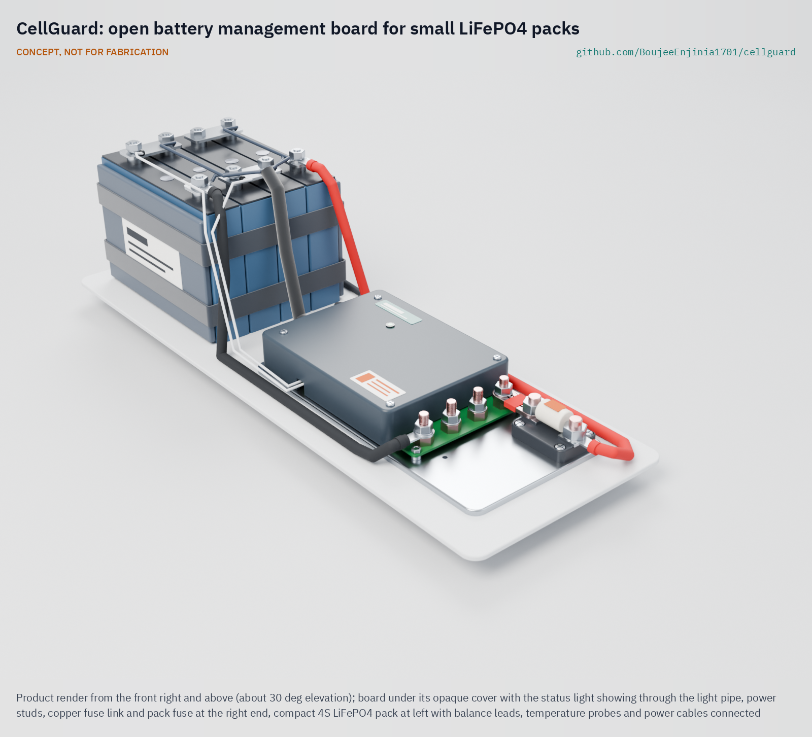
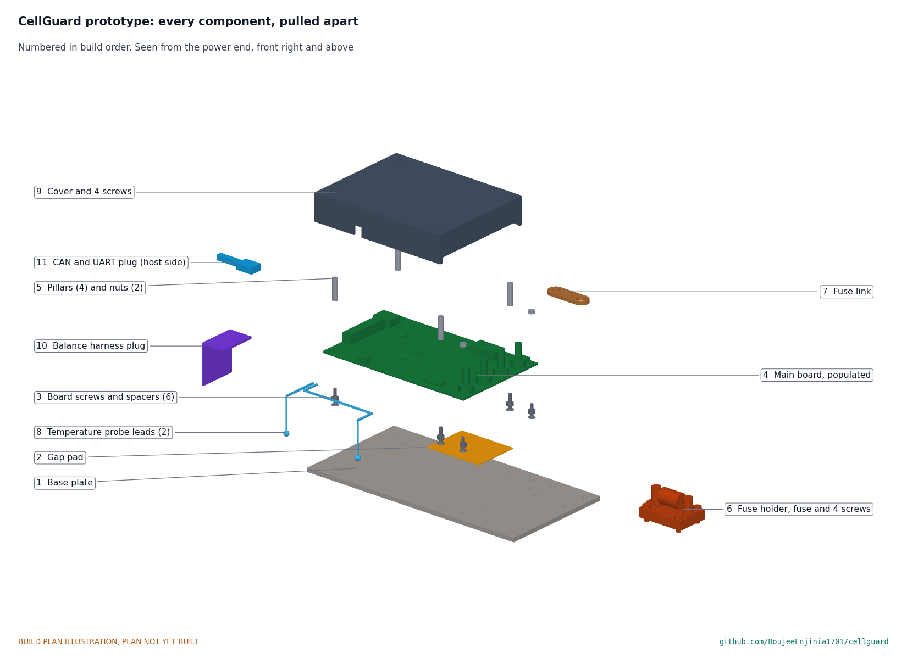

# CellGuard

     

**Area:** Shared Components · **TRL:** 3 of 9 (proof of concept on paper) · **Value-engineering target:** about $140 USD (a hypothetical control target, not a limit) · **Difficulty:** 4 of 5

An open battery management board for small LiFePO4 packs (4 to 16 cells) with cell balancing, protection and a documented state-of-charge estimate, reusable across the lab's vehicles, storage and field kits.

[Exploded render](media/render-exploded.png) · [Detail render](media/render-detail.png) · [Interactive 3D model](media/viewer.html) · [Concept blueprint (PDF)](media/concept-blueprint.pdf) · [General arrangement CGD-DWG-001 (PDF)](cad/drawings/CGD-DWG-001.pdf) · [Sizing calculations](docs/04-calcs/01-sizing.md) · [Prototype build plan](docs/05-build-plan.md) · [Design decisions](docs/06-design-decisions.md) · [Review note](docs/REVIEW.md)

## Concept rationale

A single, openly documented BMS removes the riskiest unknown from every battery project in the lab and gives SwapCell, PowerBox, SunSpoke and MotionCore a common safety layer. The concept puts protection in one proven cell-monitor chip that trips the pack's switches on its own, backs it with an independent secondary protector, and keeps the microcontroller for the parts that users need to read and check: the state-of-charge estimate, the event log and the CAN interface. Switches, sensing, precharge and the pack fuse sit on one aluminium plate, so the whole protection path can be built and tested as one part.

It is open and garage-buildable because the value of a BMS lies in knowing exactly what it does. Every threshold sits in a plain configuration file, the firmware and state-of-charge method are published, and the parts can be soldered with a hot plate or hot-air station. A repairer can read a fault log instead of scrapping a pack, and a builder can test the board on a bench before trusting it with cells.

## Burning platform

Lithium battery fires in light vehicles and homes are rising, and the battery management system is the main barrier between a cell fault and a fire. In the United States, the Consumer Product Safety Commission counts 227 micromobility battery incidents from 2019 to 2023, associated with 39 deaths and 181 injuries, and in 2026 proposed a mandatory safety standard in which BMS protections are central ([Federal Register, 24 June 2026](https://www.federalregister.gov/documents/2026/06/24/2026-12749/safety-standard-for-lithium-ion-batteries-used-in-micromobility-products-and-electrical-systems-of)). New York City alone recorded 268 lithium-ion battery fires and 18 deaths in 2023 ([FDNY](https://www.nyc.gov/site/fdny/news/03-25/fdny-commissioner-robert-s-tucker-significant-progress-the-battle-against-lithium-ion)), and London Fire Brigade attended a record 206 e-bike and e-scooter fires in 2025 ([London Fire Brigade](https://www.london-fire.gov.uk/news/2026-news/january/record-number-of-e-bike-and-e-scooter-fires-across-london-in-2025-as-brigade-calls-for-regulation-to-be-introduced)).

At the same time, more people depend on small lithium packs for basic power: solar home systems made up more than a third of new electricity connections in sub-Saharan Africa in 2023 ([IEA](https://www.iea.org/commentaries/electricity-access-continues-to-improve-in-2024-after-first-global-setback-in-decades)). Builders and repairers of these packs cannot inspect or fix closed battery management boards, so faults stay hidden until a pack fails.

## Where it could be used

### By industry

| Industry | Use |
| --- | --- |
| Light electric vehicles | Protection and state of charge for e-bike, cargo trike and scooter packs, including the lab's SwapCell and SunSpoke |
| Off-grid and backup power | 12, 24 and 48 V LFP banks for solar home systems, shops and clinics, and portable stations such as PowerBox |
| Telecom and remote monitoring | Battery backup for small towers, gateways and monitoring stations |
| Marine and recreational vehicles | LFP house batteries replacing lead-acid in boats, vans and caravans |
| Light robotics and agriculture | Packs for field robots, carts and automated guided vehicles built on MotionCore |
| Education and repair | Teaching battery safety in vocational courses; diagnosing packs in repair shops and repair cafés |

### By country or region

| Country or region | Why it matters there |
| --- | --- |
| United Kingdom | London had a record 206 e-bike and e-scooter fires in 2025, and the fire brigade is calling for regulation ([London Fire Brigade](https://www.london-fire.gov.uk/news/2026-news/january/record-number-of-e-bike-and-e-scooter-fires-across-london-in-2025-as-brigade-calls-for-regulation-to-be-introduced)) |
| United States | 268 lithium-ion battery fires and 18 deaths in New York City in 2023 ([FDNY](https://www.nyc.gov/site/fdny/news/03-25/fdny-commissioner-robert-s-tucker-significant-progress-the-battle-against-lithium-ion)); a federal micromobility battery standard is proposed ([Federal Register](https://www.federalregister.gov/documents/2026/06/24/2026-12749/safety-standard-for-lithium-ion-batteries-used-in-micromobility-products-and-electrical-systems-of)) |
| European Union | Since 18 August 2024, batteries for light vehicles, stationary storage and electric vehicles must hold state-of-health data in their BMS ([Regulation (EU) 2023/1542](https://eur-lex.europa.eu/eli/reg/2023/1542/oj/eng)) |
| Australia | Fire and Rescue NSW recorded 272 lithium-ion battery fires and 38 injuries in 2023 ([FRNSW](https://www.fire.nsw.gov.au/media/news/2024/20240315-fire-and-rescue-nsw-recording-lithium-ion-battery-fires-at-a-rate-of-five-a-week)) |
| India | Fires in electric two-wheelers led to added battery safety requirements, including the BMS, from 1 October 2022 ([Press Information Bureau](https://www.pib.gov.in/PressReleaseIframePage.aspx?PRID=1856114&reg=3&lang=2)); many small workshops assemble and repair packs |
| Sub-Saharan Africa | About 600 million people lacked electricity in 2023, and solar home systems made up more than a third of new connections ([IEA](https://www.iea.org/commentaries/electricity-access-continues-to-improve-in-2024-after-first-global-setback-in-decades)); local technicians need BMS boards they can repair |

## What sparked the idea

The starting point was the self-balancing scooter, or hoverboard, recall of July 2016. The US Consumer Product Safety Commission and ten firms recalled about 501,000 units because their lithium-ion battery packs could overheat, smoke, catch fire or explode, after at least 99 reported incidents that included burn injuries and property damage ([CPSC recall notice, 6 July 2016](https://www.cpsc.gov/Recalls/2016/Self-Balancing-Scooters-Hoverboards-Recalled-by-10-Firms)). The recall spanned products from ten firms, and nothing published let a buyer or repairer see what limits a pack's protection electronics enforced or how they would fail. CellGuard takes the opposite position for the small LFP packs that builders assemble themselves: publish every threshold, the failure analysis and the state-of-charge method, and back the main protection with an independent second layer, so that the protection can be checked before a pack is trusted rather than after it fails.

## Problem

Small builders either buy closed battery management boards with unknown firmware and limits, or skip protection altogether. Both lead to damaged packs and fires, and neither teaches anything.

Full problem statement: [docs/01-problem.md](docs/01-problem.md)

## Concept

An open battery management board for small LiFePO4 packs (4 to 16 cells) with cell balancing, protection and a documented state-of-charge estimate, reusable across the lab's vehicles, storage and field kits.

A single cell-monitor and protection chip measures every cell and opens the charge or discharge MOSFETs on its own when a limit is crossed; an independent secondary protector blows a protector fuse if that layer fails. A microcontroller adds a state-of-charge estimate anchored at full and empty, a state-of-health event log and an open CAN and UART interface carrying the SwapCell message set. Calculated at TRL 3 (CGD-CAL-001 v0.3): 40 A continuous with MOSFET junctions near 54 °C at 40 °C ambient, 4.4 W board loss at 40 A (against a 4 W target), 100 mA passive balancing, about 55 µA sleep current, 220 x 110 x 33 mm and about 0.66 kg. Two requirements are not met on paper: board loss and state of charge on small packs. Amish decided the responses on 2026-10-02: lower-resistance switches for about 3.5 W, and a prompt for a full charge when about five days pass without one. The mass target is now 0.7 kg, which the board meets. The $138 parts cost meets the $140 budget before the lower-resistance switches are priced.

Full design precis: [docs/02-concept.md](docs/02-concept.md) · Requirements: [docs/03-requirements.md](docs/03-requirements.md)

## Key components

- Cell monitor and protection IC for 3 to 16 cells, with passive balancing (TI BQ76952 class)
- Independent secondary protector (TI BQ77216 class) with a self-control protector fuse
- Charge and discharge MOSFET switches: 8 x 100 V, high side, top-side cooled, on an aluminium heat spreader
- 0.25 mΩ current shunt
- Temperature sensors, 3 points
- Microcontroller with CAN and UART (STM32G0B1 class)
- Fuse and precharge circuit
- Enclosure and harness

The component choices were decided by Amish on 2026-09-25 ([CGD-DDR-001](docs/decisions/0001-trl2-review-decisions.md), [CGD-DDR-002](docs/decisions/0002-recommendations-accepted.md)). The priced bill of materials is in [bom/bom.csv](bom/bom.csv): an estimated $138 in parts, within the $140 value-engineering target ($2 under).

## Building the prototype

The [prototype build plan](docs/05-build-plan.md) (CGD-BLD-001) shows, in pictures drawn from the model, how each of the 11 components is made and how it fits the next: a drilled and tapped aluminium plate, a cut gap pad, a populated four-layer board on six spacers, a bolted fuse holder joined to the B+ stud by a straight copper link, and a printed cover on four pillars. Making the design buildable changed some concept details, such as the board fixings, the cover notches and the fuse position; each change is recorded in [CGD-DDR-003](docs/decisions/0003-design-for-construction.md). It is a plan, not yet built: first power-up is always on a cell simulator. Open decisions are kept in the [design decisions register](docs/06-design-decisions.md).

## Safety

> Lithium cells can overheat, vent and burn, and a large pack can deliver thousands of amperes into a short circuit. Use LFP cells, fit a DC-rated pack fuse sized for the pack, charge only within the cell maker's limits and never leave a first build charging unattended. A 16S pack of large cells can drive about 4.7 kA into a short (CGD-CAL-001), so the pack fuse needs a 10 kA DC breaking capacity. Test every new board and every threshold change on a cell simulator or current-limited bench supply before connecting cells. CellGuard is a research and prototype design; it is not certified.

## Repository layout

| Folder | Contents |
| --- | --- |
| `docs/` | Problem, concept, requirements, calculations and design decisions |
| `cad/src/` | build123d Python source, the source of truth for all geometry |
| `cad/step/`, `cad/stl/` | Exported models for FreeCAD, other CAD tools and printing |
| `cad/drawings/` | 2D sketches and dimensioned drawings |
| `bom/` | Bill of materials |
| `electronics/` | KiCad schematics and PCB layouts |
| `firmware/` | Microcontroller code |
| `media/` | Renders, perspectives and photos |
| `build-log/` | Dated prototyping notes |

## Documentation

Controlled documents follow the portfolio [documentation standard](.kit/STANDARDS.md). Each carries a document ID (CGD-PRC-001 for the precis), a version and a revision history. Branded PDFs are built with `python .kit/render.py` and attached to GitHub Releases when a document is tagged, for example `CGD-PRC-001/v1.0`.

## Credits

Designed by Amish Chadha. See [CONTRIBUTORS.md](CONTRIBUTORS.md) for roles. To cite this design, use [CITATION.cff](CITATION.cff) (GitHub shows it as "Cite this repository").

AI assistance (Claude) was used to accelerate concept renders, prototype documentation and first-pass sizing calculations. Design direction and all decisions are Amish Chadha's, recorded in this repository's decision records (`docs/decisions/`).

## Licenses

- **Hardware** (CAD, drawings, BOM, electronics): [CERN-OHL-S v2](LICENSE)
- **Software** (firmware, scripts, notebooks): [MIT](LICENSE-SOFTWARE). Any code reused from the Apache-2.0 Libre Solar BMS firmware will keep its own license and notices in `firmware/third_party/` and be listed in `LICENSE-SOFTWARE`.

A project of the [Design Molecule](https://designmolecule.com) lab.
