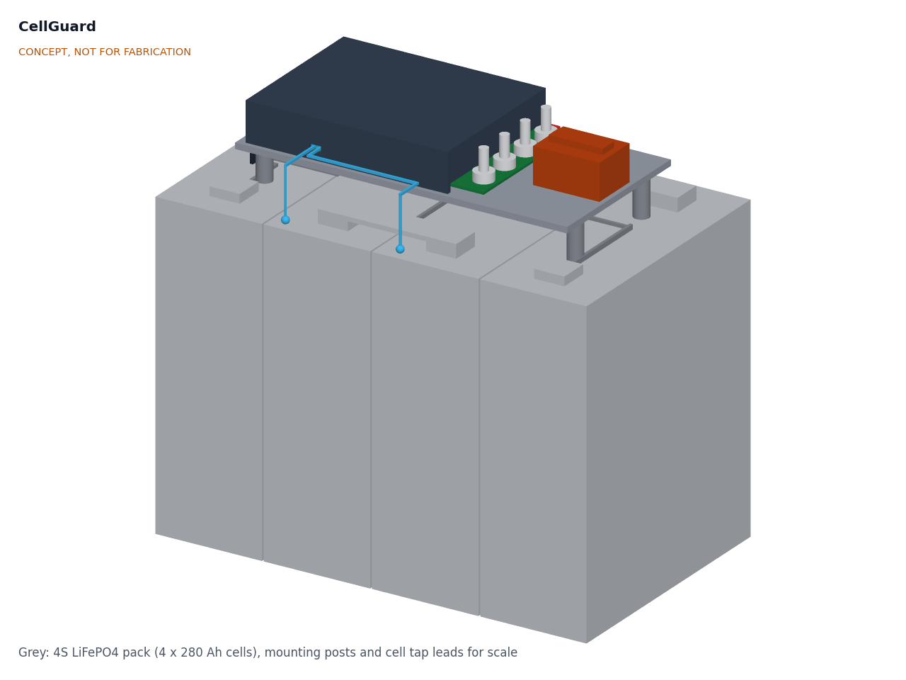
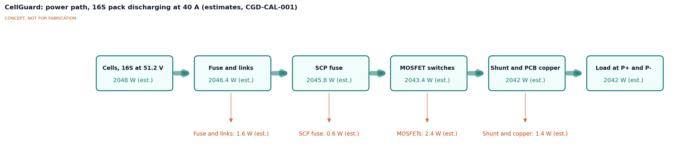
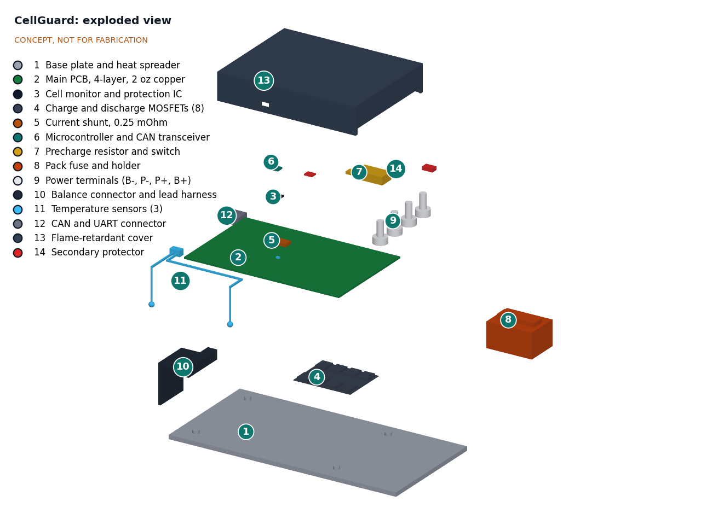
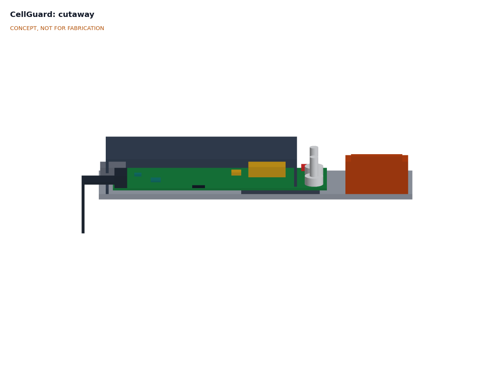

# CellGuard design precis

## Summary

CellGuard is one open battery management board for LFP packs of 4 to 16 cells in series. A single cell-monitor and protection chip measures every cell, trips the pack's MOSFET switches on its own when a limit is crossed, and balances the cells; a small microcontroller adds the state-of-charge estimate, a state-of-health log and an open CAN and UART interface. An independent secondary protector blows a self-control protector (SCP) fuse if the main protection fails. Everything sits on an aluminium base plate that spreads heat and also carries the pack fuse, so the whole protection path is one part that other lab projects can bolt on. The TRL 3 calculations (CGD-CAL-001) show 9 of 16 requirements met on paper. Four are not met: board loss 4.4 W against 4 W (R6), state of charge on small packs (R8), mass 0.65 kg against 0.6 kg (R14) and cost $134 against the $120 budget (R16).

*Figure 1. CellGuard on four posts above a 4S LFP pack of 280 Ah prismatic cells, shown for scale. Generated from `cad/src/model.py`. Concept, not for fabrication.*

## How it works

1. **Measure.** The front end (BOM 3) reads every cell voltage through the balance harness (10), pack current through a 0.25 mΩ shunt (5) and three temperatures (11): two cell probes and one thermistor beside the MOSFETs.
2. **Protect.** The front end compares each reading with thresholds loaded from the configuration file at startup. If a cell goes above 3.65 V it opens the charge MOSFETs; below 2.50 V it opens the discharge MOSFETs; on overcurrent, short circuit or temperature faults it opens both (4). This happens in the front end's own hardware, so a firmware crash in the microcontroller does not stop protection. A separate secondary protector (14) watches every cell as well and, if the front end or a MOSFET fails, blows the SCP fuse in the B+ path.
3. **Balance.** When the pack is near full and cells differ by more than a set amount (default 10 mV), the front end bleeds up to 100 mA from the higher cells through external balance resistors.
4. **Connect safely.** The discharge path stays off until the host pulls the enable line. The precharge switch and resistor (7) first charge the host's input capacitors, then the main discharge MOSFETs close. The pack fuse (8) is the last line of defense against a short circuit that the MOSFETs cannot clear.
5. **Estimate and report.** The microcontroller (6) counts charge in and out, corrects the count at full charge and near empty, logs every charge and discharge event to flash and publishes status on CAN and UART (12).

*Figure 2. Power path for a 16S pack discharging at 40 A. All values are estimates from CGD-CAL-001.*

## Main components

Table 1. Main components. Numbers match the exploded view (Figure 3) and `bom/bom.csv`.

| BOM | Component | Concept choice | Notes |
| --- | --- | --- | --- |
| 1 | Base plate and heat spreader | 6061 aluminium, 220 x 110 x 4 mm, with PCB standoffs | Takes MOSFET heat through a thermal pad; carries the fuse |
| 2 | Main PCB | 4-layer, 2 oz (70 µm) copper, 150 x 95 mm | Power copper on inner layers; clearances for 60 V |
| 3 | Cell monitor and protection IC | TI [BQ76952](https://www.ti.com/product/BQ76952): 3 to 16 cells, ±15 mV total cell voltage error from −40 to 85 °C, integrated high-side N-channel MOSFET driver, coulomb counter, I²C | Adopted for TRL 3, open for Amish's review (CGD-DDR-001 item 1) |
| 4 | Charge and discharge MOSFETs | 8 x 100 V N-channel, 2.5 mΩ or less, top-side cooled (TOLT) package preferred, TOLL acceptable: 4 in parallel for charge, 4 for discharge, back to back | Mounted on the PCB underside, pressed onto the base plate through an insulating pad |
| 5 | Current shunt | 0.25 mΩ metal element, 3 W, low side between B- and P- | 10 mV at 40 A |
| 6 | Microcontroller and CAN transceiver | STM32G0B1 class with built-in CAN controller, plus a 3.3 V CAN transceiver | Runs state of charge, log and interface; not in the protection path. Adopted for TRL 3, open for Amish's review (item 2) |
| 7 | Precharge | 100 Ω 10 W aluminium-housed resistor with a DPAK-class P-channel MOSFET, driven by the front end's precharge output | 1 s timeout in firmware; switch sized for a 34 W peak |
| 8 | Pack fuse and holder | 60 A, DC rated 80 V or more, breaking capacity 10 kA or more | In the B+ lead, bolted to the base plate |
| 9 | Power terminals | Four M6 studs: B+, B-, P+, P- | Pack side (B) and load or charger side (P) |
| 10 | Balance connector and harness | 17-way connector, 16 sense leads plus B- reference, each lead fused or resistor-protected at the cell end | Unused inputs linked on the board for packs under 16S |
| 11 | Temperature sensors | Three 10 kΩ NTC thermistors: two ring-lug probes on cells, one on the board by the MOSFETs | Charge locked out below 0 °C |
| 12 | CAN and UART connector | Latching 6-way connector: CAN-H, CAN-L, UART TX and RX, enable, ground | Enable keeps the output off until the host is connected |
| 13 | Cover | Flame-retardant polycarbonate (UL 94 V-0 grade), printed or cut and bent | Leaves the studs and fuse reachable |
| 14 | Secondary protector and SCP fuse | TI [BQ77216](https://www.ti.com/product/BQ77216) class: 3 to 16 cells, overvoltage, undervoltage, open wire and temperature, separate COUT and DOUT outputs, about 1 µA; drives a self-control protector fuse in the B+ path | Adopted for TRL 3, open for Amish's review (item 3); SCP rating at 40 A and 60 V to be confirmed |
| 15 | Supporting electronics | 60 V input buck regulator, 16 Mbit SPI flash, TVS diode across P+ and P-, balance resistors, passives | Not shown in the model |

*Figure 3. Exploded view with BOM numbers.*

*Figure 4. Section through the board: MOSFETs (4) under the PCB on the base plate (1), precharge resistor (7), studs (9) and fuse (8), all under or beside the cover (13).*

The general arrangement is drawing CGD-DWG-001 Rev P1 (`cad/drawings/CGD-DWG-001.pdf`), and the STEP files are in `cad/step/`.

## Key design choices

Choices 1 to 7 are adopted as recommended for TRL 3 under Amish's 2026-09-25 instruction, open for his review (CGD-DDR-001). The licensing question in choice 3 stays proposed, awaiting Amish.

1. **One analog front end for 4 to 16 cells.** A single BQ76952-class chip covers the whole cell range on one board and runs protection without the microcontroller. Alternatives: an Analog Devices ADBMS or LTC681x daisy-chain monitor (better for large packs, but needs a separate protection path and more firmware), or a Renesas ISL94202 as on the Libre Solar board (autonomous, but limited to 8 cells). Adopted: BQ76952 class.
2. **High-side switching.** N-channel MOSFETs in the positive lead keep B- and P- at nearly the same potential, so the CAN and UART ground stays common with the host. Low-side switching is cheaper but breaks the common ground whenever the pack trips. Adopted: high side.
3. **Microcontroller and firmware base.** Option A: STM32G0B1 class with built-in CAN, building on the open [Libre Solar BMS firmware](https://github.com/LibreSolar/bms-firmware) (Apache-2.0, supports bq769x2 front ends). Option B: ESP32-C6 class with Wi-Fi and Bluetooth for a phone app, at higher idle current. Option C: a new firmware from scratch. Adopted: A. Apache-2.0 code inside an MIT-licensed repo must keep its own license notices; how to handle that is proposed, awaiting Amish.
4. **40 A continuous rating.** Covers a 30 A vehicle controller and a 400 W inverter on a 12.8 V pack. A 100 A variant would need more MOSFETs, heavier copper and a larger plate. Adopted: 40 A for the first board.
5. **Passive balancing at 100 mA.** Simple and cheap; adequate for packs up to about 100 Ah. Active balancing is out of scope.
6. **Independent secondary protector.** A BQ77216-class protector and SCP fuse close the single-fault gap (R4) for about $10, at the cost of about 0.6 W in the power path. Adopted.
7. **Fuse on the base plate.** Keeps the fuse, switches and sensing together as one tested assembly, at the cost of a longer plate. Kept.
8. **CAN message set.** CellGuard carries the SwapCell interface v0.3 message set (250 kbit/s) as a profile, so SwapCell hosts such as PowerBox and SunSpoke can read a CellGuard pack without changes. Adopted, subject to the SwapCell project agreeing.
9. **Chemistry scope.** Hardware for LFP and for an NMC profile up to 14 cells (under 60 V), so CellGuard could serve as SwapCell's 13S BMS; LFP firmware first. Adopted, subject to the SwapCell project. An NMC build needs the NMC threshold option of the secondary protector and SwapCell's INTERLOCK wake input.

## Key numbers

These values come from CGD-CAL-001, which states every assumption; they are calculations, not measurements.

Table 2. Key numbers at TRL 3.

| Quantity | Value | Requirement |
| --- | --- | --- |
| Board loss at 40 A (MOSFETs 2.38 W, shunt 0.40 W, copper 1.02 W, SCP fuse 0.64 W) | 4.44 W | R6, 4 W: **not met** |
| External fuse and links at 40 A | 1.60 W | |
| Power path efficiency, 16S at 40 A | 99.71 % | |
| Plate temperature rise at 40 A | 12.9 K | |
| MOSFET junction at 40 A and 40 °C ambient | 53.7 °C (TOLT), 61.4 °C (TOLL) | R5, 110 °C: met |
| MOSFET junction bound, 80 A for 10 s | 58.1 °C (TOLT), 97.7 °C (TOLL) | R5: met |
| Protection settings | SCD 400 A in 15 µs, OCD2 160 A in 20 ms, OCD1 96 A in 320 ms, OCC 48 A | R3: met on paper |
| Prospective short-circuit current | 696 A (4S 20 Ah) to 4,746 A (16S 280 Ah) | Fuse breaking capacity 10 kA |
| Balancing | 103 mA, 0.350 W per channel; 1 % on 100 Ah in 9.7 h, on 280 Ah in 27.2 h | R7: at risk (resistor hotspot 73.9 °C) |
| State-of-charge error after 7 days without a full charge | 10.1 points (20 Ah), 7.4 points (100 Ah) | R8, 10 points: **not met** on 20 Ah |
| Current error at 80 A after one-point calibration | 0.404 A | R9, 0.850 A: met |
| Sleep and ship-mode current | 54.5 µA and 6.0 µA | R10: met |
| CAN bus load, 250 kbit/s | 1.84 % | R11: met |
| Log capacity | 65,536 records of 32 bytes | R12: met |
| Precharge of 2 mF to 90 % | 0.46 s, 3.38 J, 34.1 W peak | R13: met |
| Size and mass | 220 x 110 x 32 mm; 0.646 kg | R14: **not met** (mass) |
| Parts cost | $134.00 | R16: **not met** against $120; recommended $140 awaits Amish |

### State-of-charge method

LFP's flat voltage curve means voltage alone cannot give state of charge in the middle of the range. The concept uses coulomb counting from the front end's integrated coulomb counter, anchored at two points where LFP voltage does change quickly: full (all cells above 3.45 V with charge current tapering below C/20) and near empty (lowest cell below 3.0 V at light load). Between two anchors the firmware learns the usable capacity, which also feeds the state-of-health log. After a rest of two hours or more at the ends of the range, the open-circuit voltage is used as a check. The first error budget is in CGD-CAL-001 section 6: the coulomb counter's offset sets the drift, so on a 20 Ah pack the offset must stay near 1 µV across the shunt (about 4 mA) to hold 10 points over 7 days.

## Safety

> **Safety:** CellGuard connects directly to lithium cells that can deliver thousands of amperes into a short circuit. Treat every build as live. Use insulated tools, cover exposed terminals and busbars, and fit the pack fuse before connecting any load.

> **Safety:** Connect the balance harness only in the order given by the front-end maker, with the board not yet connected to the power leads, and check every sense lead voltage with a meter first. A wrong or loose sense lead can make the board report a false cell voltage, which can lead to overcharge.

> **Safety:** First power-up and all threshold changes should be tested on a cell simulator or a bench supply with current limiting, not on a full pack. Charge test packs on a non-combustible surface, inside a fire-resistant enclosure where possible, never unattended, with a lithium-rated or Class D extinguisher and sand nearby.

> **Safety:** The MOSFETs cannot always interrupt a hard short from a large pack; the fuse must be sized for the pack's prospective short-circuit current (about 4.7 kA for a 16S 280 Ah pack by CGD-CAL-001; specify a 10 kA breaking capacity) and rated for DC at 80 V or more. Set the short-circuit delay to its 15 µs minimum: at 60 µs the current in a large pack reaches about 2.5 kA before the MOSFETs open. A TVS diode across P+ and P- limits the voltage spike when the MOSFETs open under load.

> **Safety:** The secondary protector blows the SCP fuse if a MOSFET shorts or the front end fails. Until an SCP fuse rated for 40 A at 60 V DC is confirmed (R4 at risk), use only chargers with a fixed, correct end-of-charge voltage for the pack. A blown SCP fuse means a fault: inspect the board before repairing it.

> **Safety:** The precharge resistor would overheat if the load stayed shorted; firmware limits precharge to 1 s and reports a fault.

Maximum pack voltage stays below 60 V DC. CellGuard is a research, educational and prototype design. It is not certified and does not replace a certified BMS where a product must meet a standard.

## Open questions

- [ ] Licensing of reused Apache-2.0 firmware in this MIT-licensed repo. Proposed, awaiting Amish.
- [ ] Budget: $134 against $120; raising `budget_usd` to $140 is recommended. Proposed, awaiting Amish.
- [ ] Responses to R6, R8, R14 and R16 not met (options in CGD-CAL-001 section 12). Proposed, awaiting Amish.
- [ ] SwapCell project's agreement to the NMC profile and the message set profile.
- [ ] Cover rating: is a printed flame-retardant cover enough, or should the cover be sheet aluminium? Proposed, awaiting Amish.
- [ ] How to test the state-of-charge method without expensive lab equipment (for example, a calibrated shunt and a bench load)? Proposed, awaiting Amish.
- [ ] First test partner (solar installer, e-bike repair shop or makerspace). Proposed, awaiting Amish.

Concept media: [blueprint sheet](../media/concept-blueprint.pdf), [interactive 3D model](../media/viewer.html).
