# CellGuard prototype build plan

**Plan, not yet built.** How to build the first proof-of-concept prototype, component by component. Building and testing to it is TRL 4 work. Decisions still to be made are kept in the design decisions register ([docs/06-design-decisions.md](06-design-decisions.md)), not here.

## 1. What you are building

*Figure 1. Every component pulled apart and numbered in build order.*

The prototype is one CellGuard board assembly: a flat aluminium plate that spreads heat, a four-layer circuit board held 3 mm above it on six spacers with its eight power switches pressing down on an insulating gap pad, a pack fuse in a bolted holder beside the board, a short copper link from the fuse to the board's B+ stud, and a printed opaque cover over the electronics, with a light pipe that shows the board's three-colour status light. Figure 1 shows the 11 components in the order you make or fit them. Four are made in a small workshop: the plate (cut, drilled, countersunk and tapped), the gap pad (cut from sheet), the copper link (cut and drilled) and the cover (3D printed). The circuit board is ordered from a board maker and populated by hand with a hot plate and soldering iron. Everything else is bought: spacers, pillars, screws, the fuse and holder, the stud terminals, the light pipe, connectors, plugs and probe leads. The parts cost about $159 from the bill of materials.

> **Safety:** CellGuard connects straight to lithium cells. A large pack can drive several thousand amperes into a short circuit, and every exposed stud, busbar and the fuse holder is live once a pack is connected. Do all first power-ups on a cell simulator or a current-limited bench supply, keep the fuse out until section 6 says otherwise, use insulated tools and never leave a test unattended. Printing polycarbonate gives off fumes; print in a ventilated space. Hot-plate soldering uses flux that fumes; use fume extraction.

## 2. What changed to make it buildable

The concept showed what the board does; some of its parts could not be made or fixed as drawn. Each change below keeps what CellGuard does; all of them are recorded in decision record CGD-DDR-003, which Amish accepted on 2026-10-02.

*Table 1. Changes from the concept.*

| Component | The concept had | The buildable design has | Why |
| --- | --- | --- | --- |
| Board supports | Four short posts drawn as part of the plate, with no screws and no holes in the board | A flat plate, six bought 3 mm spacers and six M3 countersunk screws put up from below (Figure 6) | A flat sheet cannot carry posts; the screws hold the board and leave the plate's underside flat |
| Gap under the switches | A 0.5 mm pad that only just filled the gap | A 1.0 mm gap pad squeezed to 0.7 mm by the switches (Figure 8) | The squeeze takes up small height differences, so all eight switches press on the pad |
| Cover | Sat loose on the plate; its openings were closed, so it could not be lowered over the connectors and leads | Rests on four 20 mm pillars and is held by four screws; its openings are notches open at the bottom, and its walls stand 0.5 mm clear of the plate (Figures 12 and 13) | It drops straight down over everything already fitted and cannot rock |
| Board fixings at the power end | Where a nut would hit the B+ stud and the protector fuse | Moved into the corners, 2.2 mm clear of the stud; two more fixings carry the cover pillars (Figure 3) | Every nut and pillar has room |
| Pack fuse | A block on the centre line with no fixing and nothing joining it to the B+ stud | A bolted holder in line with the B+ stud, four M4 screws, and a straight copper link to the stud (Figure 10) | The stud and the fuse terminal are at the same height, so a flat bar joins them |
| Power studs | Drawn as plain cylinders on the board | Bought brass terminals with an M6 stud, soldered through the board (Figure 3) | This is how a board carries 40 A; the shoulder is the face the cables clamp against |
| Mounting the plate | No holes | Four M4 tapped holes, screws from below (Figure 5) | So the board can be fixed to a pack or a vehicle |
| CAN and UART connector | Hung 9 mm off the board edge and crossed the cover wall | Its front face is flush with the cover's outside face, 5 mm past the board edge | Most of its length is on the board |

## 3. Making the components

Make and check each component before the assembly step that needs it. Sizes are in millimetres. The "signal end" is the end with the connectors; the "power end" has the studs and the fuse. "The B+ side" is the side of the centre line where the B+ stud and the fuse sit. Workshop tolerance is 0.2 mm on hole positions and 0.5 mm elsewhere unless a step says otherwise; drawings do not carry tolerances before TRL 4.

### 3.1 Main board

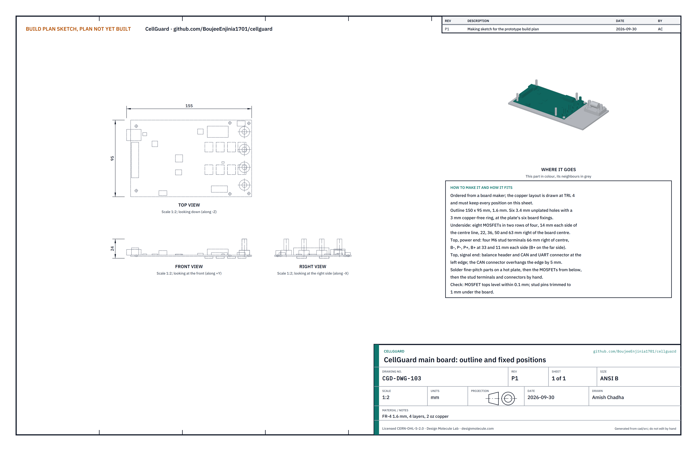

*Figure 2. Main board outline and fixed positions (CGD-DWG-103). The copper layout is drawn at TRL 4 and keeps every position shown.*

**What it is and what it is made from.** The circuit board that carries the cell monitor and protection chip, the secondary protector, the controller, the current shunt, the precharge parts, the three-colour status light, the connectors and the four power studs on its top face, and the eight power switches on its underside. The switches are 100 V parts of about 1.5 mΩ each in a package cooled through its top face. A four-layer glass-epoxy board 150 x 95 x 1.6 mm with 70 µm (2 oz) copper, ordered from a board maker together with a solder paste stencil for the top face.

**How to make it.**

1. Check the board as delivered: six 3.4 mm unplated fixing holes, each with a 3 mm ring free of copper, at the positions of Figure 2; nothing bent or scratched through the solder mask.
2. Top face, fine-pitch parts: print solder paste through the stencil, place the cell monitor and protection chip, the secondary protector, the controller, the CAN transceiver, the flash memory, the regulator, the shunt, the status light and the small parts. The status light sits 30 mm to the signal-end side of the board centre and 20 mm to the B+ side, where the cover's light pipe comes down over it. Reflow on a hot plate following the paste maker's temperature curve.
3. Inspect every fine-pitch chip under a magnifier for bridges and lifted pins; clear any bridge with flux and braid.
4. Underside: turn the board over on a support that does not touch the top-face parts. Solder the eight power switches in their two rows of four with a hot-air station. Their flat tops must end up level: lay a steel rule across each row and check that no top stands more than 0.1 mm above or below the others.
5. Fit the precharge switch and resistor by hand; hold the resistor down with a bead of high-temperature silicone under its body.
6. Fit the four stud terminals through the board and solder them from below, one at a time, with a large iron. The order across the board, from the side away from the fuse, is B-, P-, P+, B+. Trim their pins to 1 mm below the board.
7. Fit the balance header, the CAN and UART connector (its front face 5 mm past the board edge) and the probe header, and solder them by hand.
8. Wash off flux, dry, and coat the top face with conformal coating, keeping it off the stud shoulders, the connectors and the fixing holes.

**How it fits the parts next to it.**

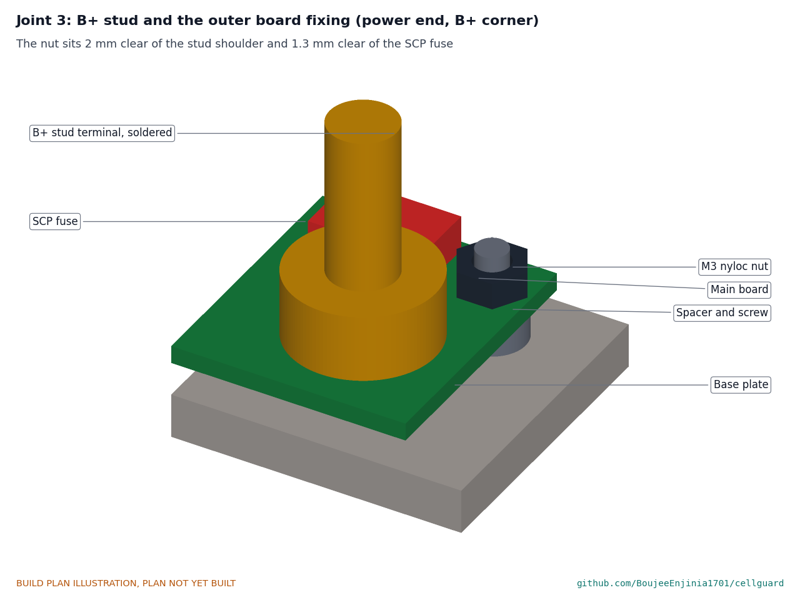

*Figure 3. At the power end the board fixing nut sits 2.2 mm clear of the B+ stud's shoulder and 1.3 mm clear of the protector fuse.*

The board lies on six spacers, 3 mm above the plate (Figure 6). The power switches press down on the gap pad (Figure 8). The stud pins, trimmed to 1 mm, stand 2 mm above the plate. Cable lugs and the copper link clamp on the stud shoulders, 10.6 mm above the plate.

**Check before moving on.** Every chip passes the magnifier check; the switch tops are level within 0.1 mm; with no power applied, the resistance from each stud to every other stud reads as the circuit expects and none reads as a short; the board drops over six M3 screws in the plate without forcing.

### 3.2 Base plate

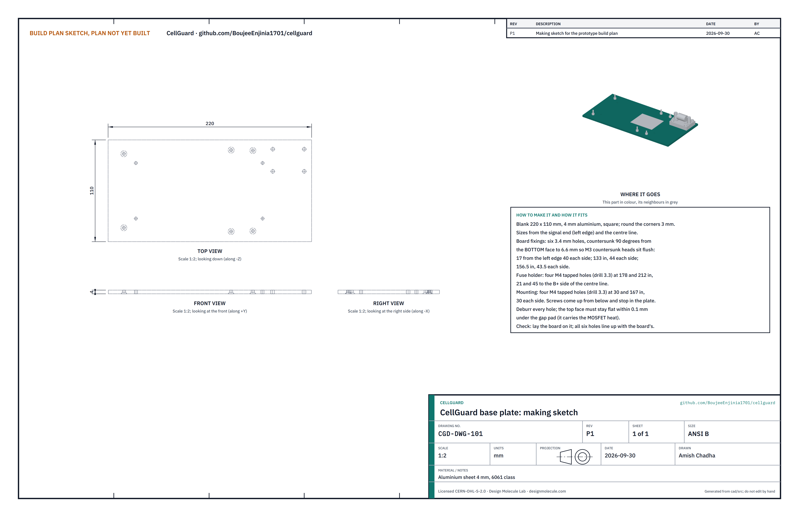

*Figure 4. Base plate making sketch (CGD-DWG-101).*

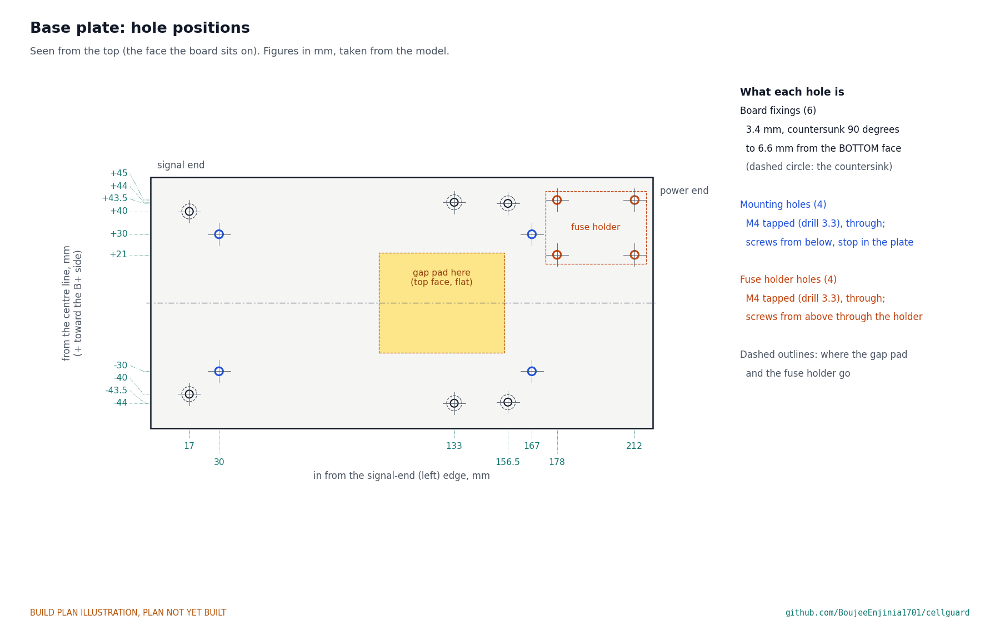

*Figure 5. Every hole, seen from the top, measured in from the signal-end edge and across from the centre line.*

**What it is and what it is made from.** The flat plate that everything sits on. It carries the switches' heat away and holds the fuse holder. Aluminium sheet 4 mm thick, 6061 class, 220 x 110 mm.

**How to make it.**

1. Cut the blank to 220 x 110 mm, square. File the edges and round the corners to about 3 mm.
2. Scribe a centre line along the long side. Choose the flatter face as the top and mark it. Mark the signal end.
3. Mark every hole from Figure 5: distances in from the signal-end edge and across from the centre line.
4. Board fixings: six 3.4 mm holes at 17 mm in, 40 each side; 133 mm in, 44 each side; 156.5 mm in, 43.5 each side. Turn the plate over and countersink each from the bottom face, 90°, to 6.6 mm across, so an M3 countersunk head sits flush.
5. Fuse holder holes: four holes at 178 and 212 mm in, 21 and 45 mm to the B+ side of the centre line. Drill 3.3 mm and tap M4 right through.
6. Mounting holes: four holes at 30 and 167 mm in, 30 mm each side. Drill 3.3 mm and tap M4 right through.
7. Deburr every hole on both faces. Stone the top face under the gap pad area (100 to 155 mm in) so no burr or scratch stands proud.

**How it fits the parts next to it.**

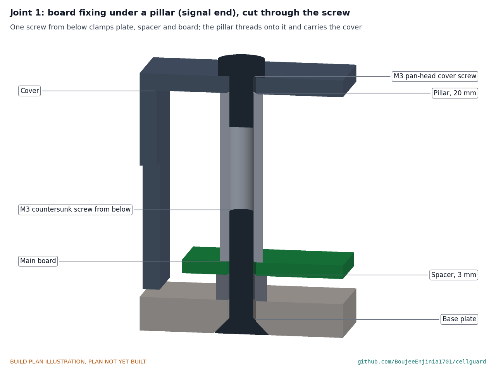

*Figure 6. One M3 countersunk screw from below clamps the plate, a 3 mm spacer and the board; at four fixings a 20 mm pillar threads onto the same screw and carries the cover.*

The board sits on six spacers on the top face. The gap pad lies on the top face under the switches. The fuse holder sits flat on the top face on its four M4 screws. Screws from the pack or vehicle come up into the mounting holes from below and must stop inside the plate.

**Check before moving on.** A straight edge across the gap pad area shows no gap over 0.1 mm; each countersunk screw sits flush or just below the bottom face; an M4 screw runs freely into every tapped hole; laying the board on the plate, all six holes line up.

### 3.3 Gap pad

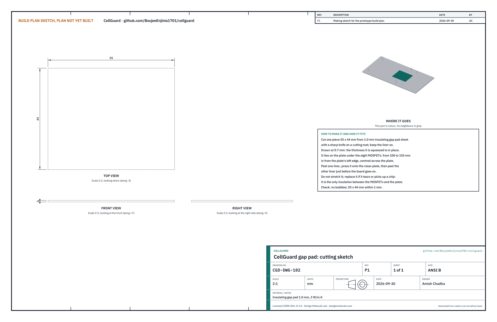

*Figure 7. Gap pad cutting sketch (CGD-DWG-102), drawn at its squeezed thickness of 0.7 mm.*

**What it is and what it is made from.** The soft, electrically insulating pad between the tops of the eight power switches and the plate. It carries their heat to the plate and is the only insulation between the live switch tops and the aluminium. Gap pad sheet 1.0 mm thick, about 3 W/(m·K), rated for at least 100 V.

**How to make it.**

1. Cut one piece 55 x 44 mm with a sharp knife against a steel rule on a cutting mat. Keep both liners on.
2. Check it for nicks, chips or anything pressed into it; throw away any piece that has one.

**How it fits the parts next to it.**

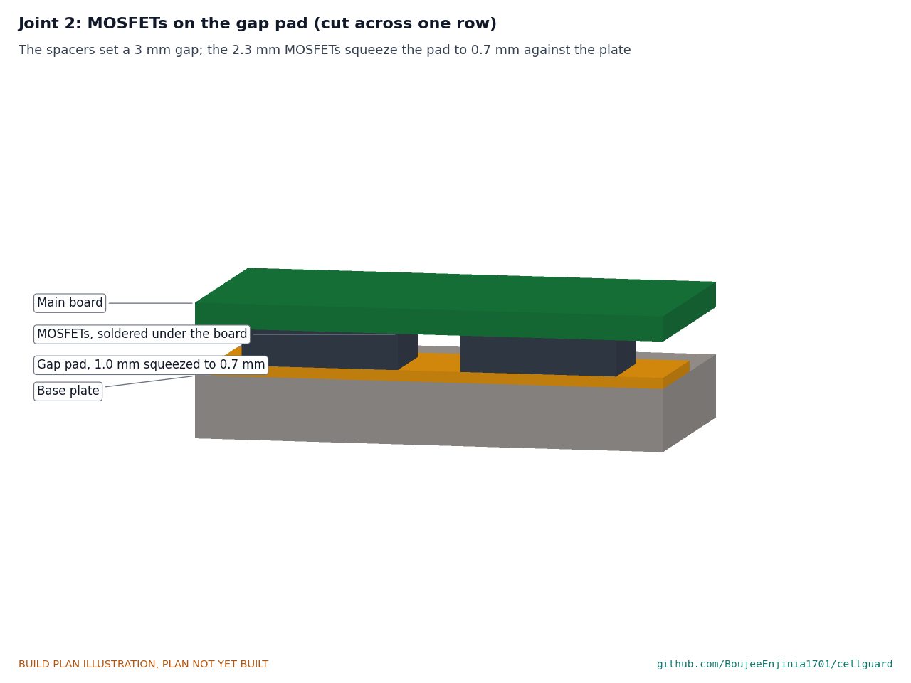

*Figure 8. The spacers set a 3 mm gap; the 2.3 mm switches squeeze the pad from 1.0 to 0.7 mm against the plate.*

It lies on the plate's top face, 100 to 155 mm in from the signal-end edge, centred across the plate. The switches press down on it when the board is screwed down, squeezing it by about 30 %.

**Check before moving on.** 55 x 44 mm within 1 mm; no tears.

### 3.4 Copper fuse link

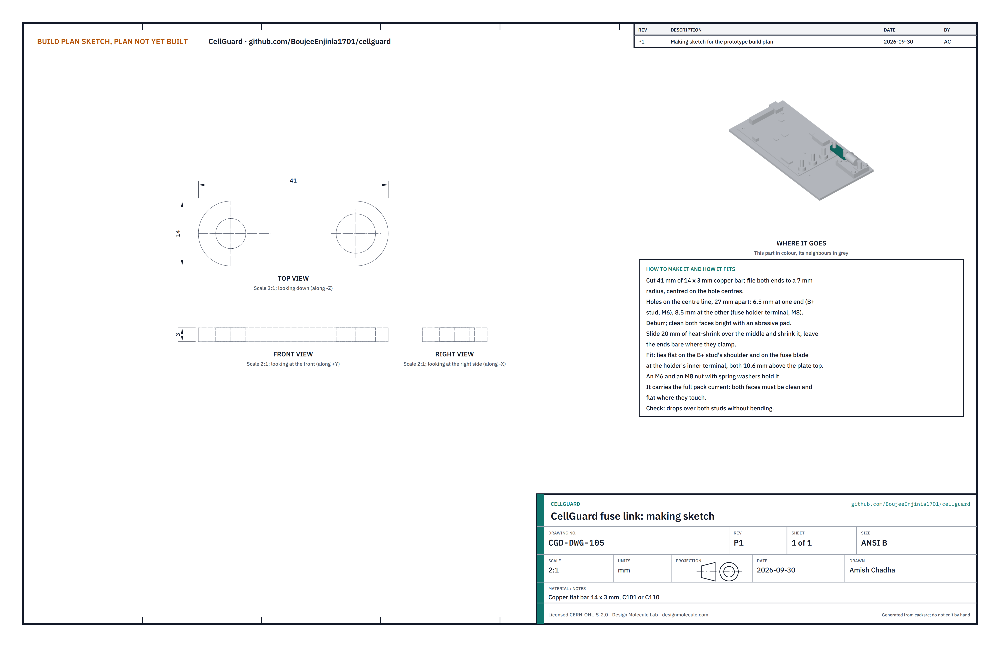

*Figure 9. Fuse link making sketch (CGD-DWG-105).*

**What it is and what it is made from.** The flat bar that carries the full pack current from the fuse holder to the board's B+ stud. Copper flat bar 14 x 3 mm, C101 or C110.

**How to make it.**

1. Cut 41 mm of bar and square the ends.
2. On the centre line, mark two hole centres 27 mm apart and 7 mm in from each end. Drill one 6.5 mm (the B+ stud end, M6) and the other 8.5 mm (the fuse holder end, M8).
3. File both ends to a 7 mm radius round the hole centres. Deburr.
4. Clean both faces bright with an abrasive pad where they will clamp.
5. Slide 20 mm of heat-shrink sleeve over the middle and shrink it, leaving both ends bare.

**How it fits the parts next to it.**

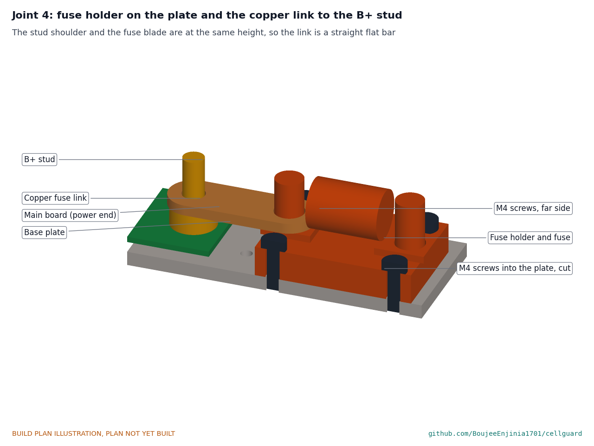

*Figure 10. The B+ stud's shoulder and the fuse blade on the holder's inner terminal are at the same height, 10.6 mm above the plate, so the link lies flat on both.*

One end lies flat on the B+ stud's shoulder, held by an M6 nut and spring washer; the other lies flat on the fuse blade at the holder's inner terminal, held by an M8 nut and spring washer. It runs 2.8 mm above the protector fuse and 7.5 mm from the P+ stud's cable lug.

**Check before moving on.** Hole centres 27 mm apart within 0.2 mm; the link drops over both studs without bending.

### 3.5 Cover

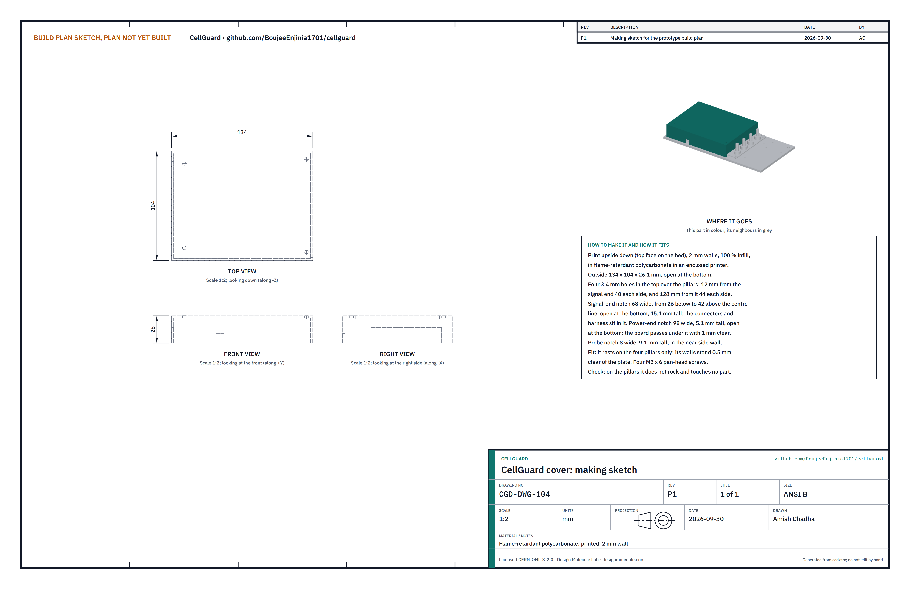

*Figure 11. Cover making sketch (CGD-DWG-104).*

**What it is and what it is made from.** The lid over the electronics, from the signal end to just short of the studs, with a bought light pipe pressed into its top so the status light can be seen. Opaque flame-retardant polycarbonate (UL 94 V-0 grade), printed, 2 mm walls. The light pipe is a round, flanged clear pipe 3 mm across and 19.6 mm long below its flange.

**How to make it.**

1. Print upside down, with the top face on the bed, at 100 % infill, in an enclosed printer that prints polycarbonate. Let it cool on the bed.
2. Check the outside size: 134 x 104 x 26.1 mm.
3. Check the four 3.4 mm holes in the top: 12 mm from the signal-end face at 40 mm each side, and 128 mm from it at 44 mm each side. Open them with a 3.4 mm drill by hand if needed.
4. Check the three notches, all open at the bottom: at the signal end, 68 mm wide and 15.1 mm tall, from 26 mm on the side away from the fuse to 42 mm on the B+ side; at the power end, 98 mm wide and 5.1 mm tall; in the long side away from the fuse, 8 mm wide and 9.1 mm tall, 42 to 50 mm from the signal-end face.
5. Check the 3.2 mm light pipe hole in the top, 50 mm from the signal-end face and 20 mm to the B+ side of the centre line. Open it with a 3.2 mm drill by hand if needed; it must hold the light pipe snugly.
6. Remove strings and sharp edges.
7. Press the light pipe into its hole from above until its flange sits flat on the top face.

**How it fits the parts next to it.**

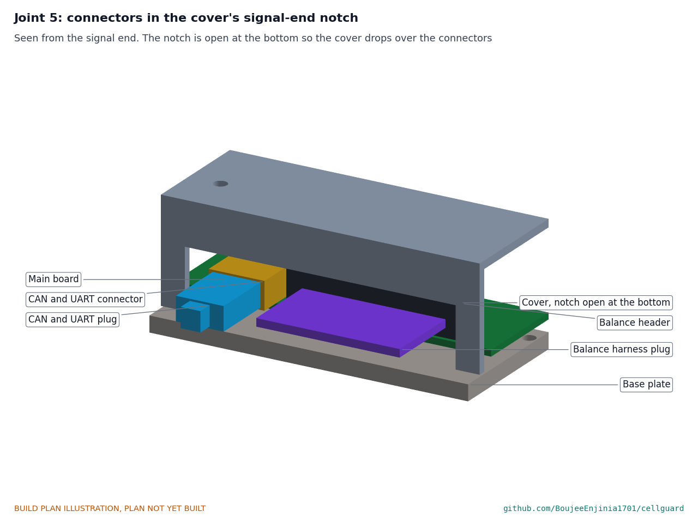

*Figure 12. The connectors, the harness plug and the CAN plug sit in the signal-end notch, which is open at the bottom.*

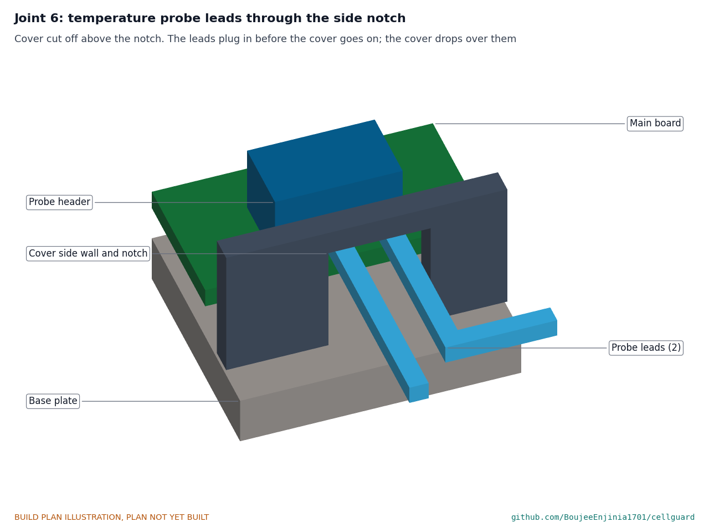

*Figure 13. The two probe leads leave through the side notch; they are plugged in before the cover goes on.*

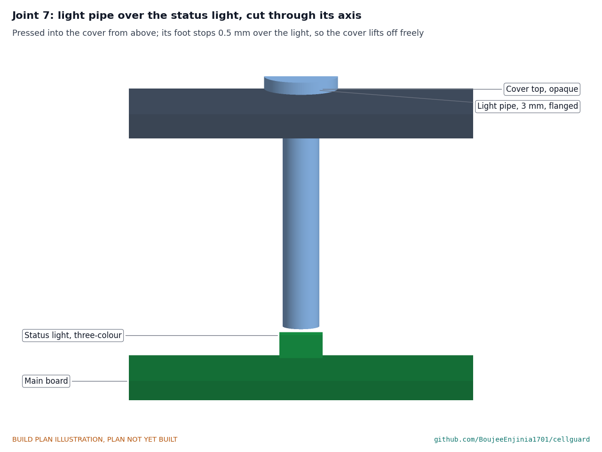

*Figure 14. The light pipe's flange sits on the cover top; its foot stops 0.5 mm above the status light, so the cover lifts off without touching the board.*

The cover rests only on the tops of the four pillars and is held by four M3 x 6 pan-head screws. Its walls stand 0.5 mm clear of the plate. The board passes under the power-end wall with 1 mm to spare. The studs and the fuse stay outside the cover, at least 5.5 mm from it, so cables can be fitted with the cover on. The light pipe stands directly over the status light (Figure 14).

**Check before moving on.** On the pillars of an assembled board it does not rock and touches nothing but the pillar tops; the light pipe flange sits flat on the top face and the pipe stands square to it.

### 3.6 Bought components and connections

Buy to specification, not brand. Line numbers are those of the bill of materials.

- **Electronic parts (lines 3 to 7, 10 to 12, 14, 15).** As listed in the bill of materials, with a mating plug for the balance header and for the CAN and UART connector. The eight power switches are 100 V, about 1.5 mΩ each, in a 2.3 mm tall package cooled through its top face; the status light is one three-colour light in a 3.5 x 2.8 mm package.
- **Light pipe (line 19).** A round, flanged light pipe 3 mm across, 19.6 mm long below a flange about 6 mm across and 1 mm thick. Cut a longer one to length with a fine saw and polish the cut end.
- **Pack fuse and holder (line 8).** 60 A fuse, DC rated 80 V or more, breaking capacity 10 kA or more. Holder with an insulating base no larger than 44 x 32 mm, four M4 fixing holes, two M8 terminal studs, and the fuse blade faces 12.6 mm above its mounting face (10.6 mm above the plate top once fitted).
- **Power terminals (line 9).** Four through-hole soldered brass terminals with an M6 stud and a 13 mm shoulder 6 mm tall, with nuts, spring washers and ring lugs.
- **Gap pad and fixings (line 17).** Gap pad sheet as section 3.3; six round aluminium spacers M3 x 3 mm, 6 mm across; four round aluminium pillars M3 female-female x 20 mm, 5 mm across; six M3 x 12 countersunk screws; two M3 nyloc nuts; four M3 x 6 pan-head screws; four M4 x 12 pan-head screws; conformal coating.
- **Power cables (line 16).** 10 mm² (8 AWG) silicone cable with ring lugs: from the pack's B+ to the holder's outer terminal (M8), from the pack's B- to the B- stud, and from the P+ and P- studs to the load or charger (M6).

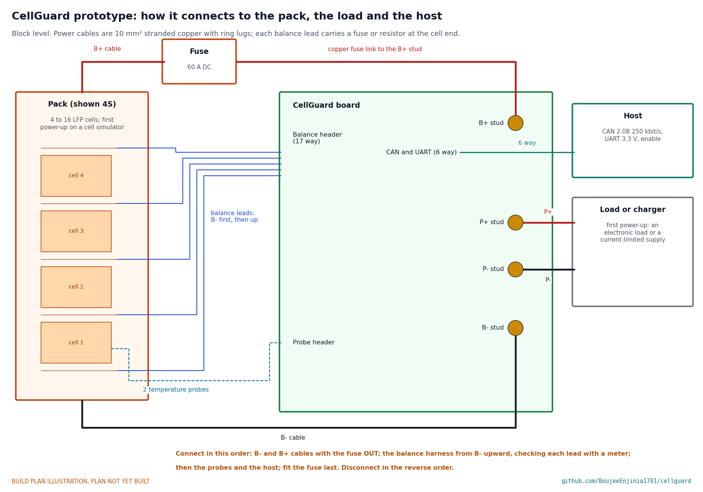

*Figure 15. Connections at block level, with the order in which they are made.*

## 4. Putting it together

In each picture the parts already fitted are grey and the part being fitted is in colour, with an arrow showing the way it goes in.

### Step 1: populate the main board

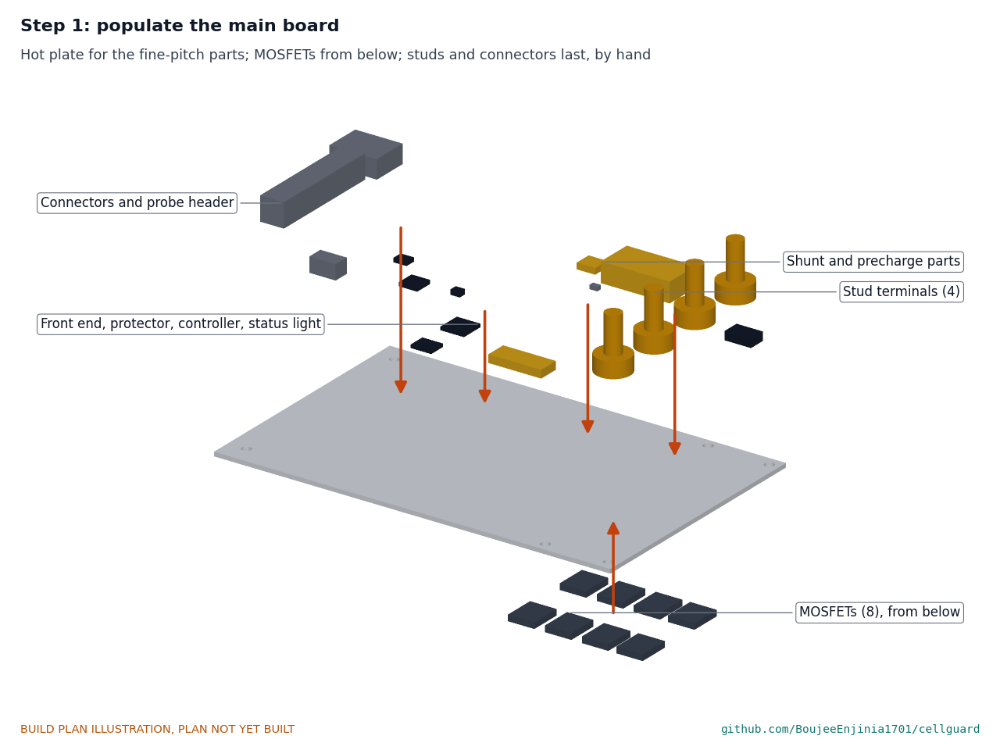

As section 3.1: fine-pitch parts on the top face on a hot plate, then the eight switches on the underside, then the stud terminals and connectors by hand. **Hold point:** the checks of section 3.1 pass before going on.

### Step 2: gap pad onto the base plate

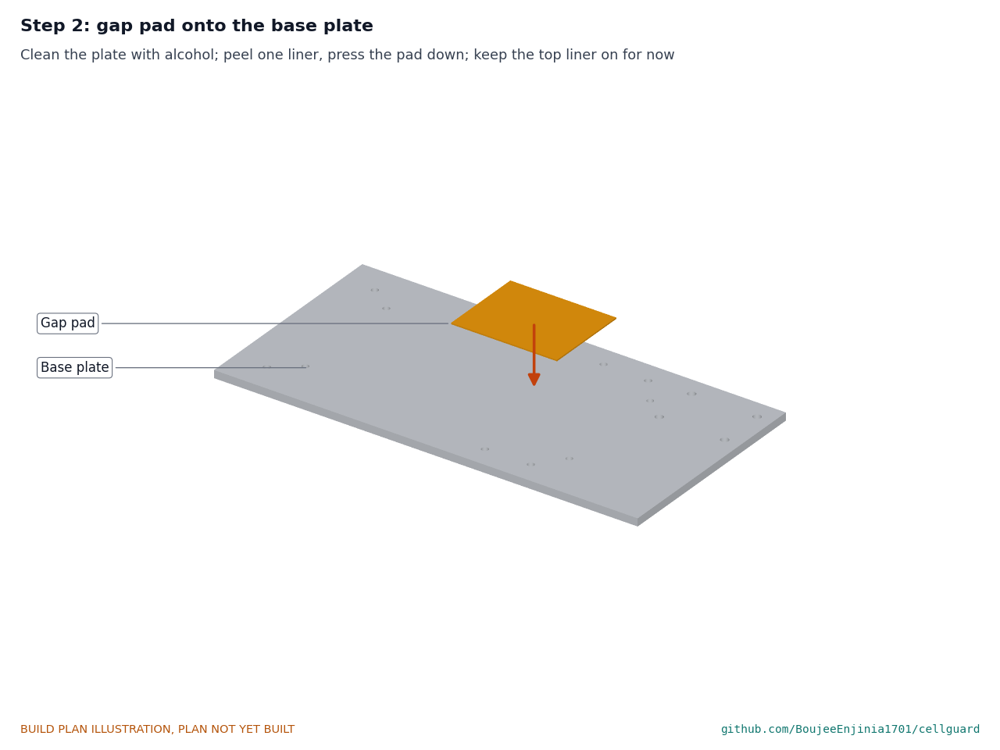

Clean the plate's top face with isopropyl alcohol. Peel one liner from the pad and press it down in its place, from the middle outward so no air is trapped. Leave the top liner on.

### Step 3: board screws and spacers

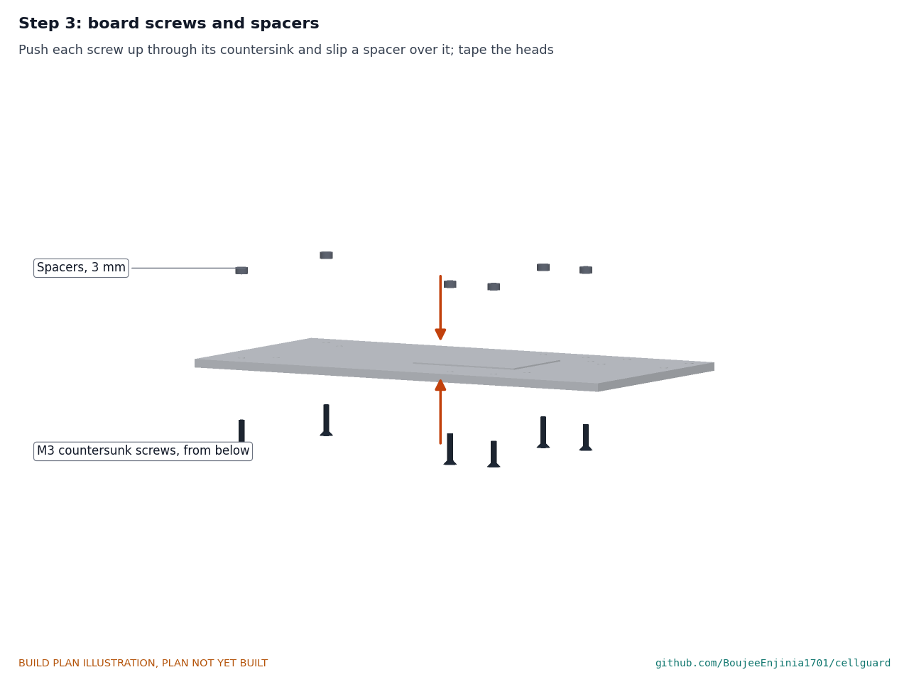

Push an M3 x 12 countersunk screw up through each of the six countersunk holes from below and slip a 3 mm spacer over each. Lay the plate on a flat block with clearance for the screw heads, or tape the heads, so the screws stay in.

### Step 4: main board onto the spacers

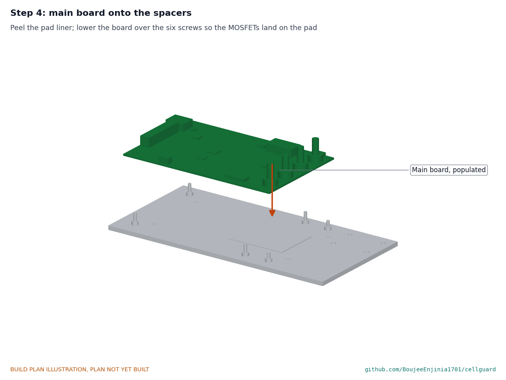

Peel the pad's top liner. Lower the board straight down over the six screws, studs toward the power end, so the switches land on the pad. Do not slide it on the pad.

### Step 5: pillars and nuts

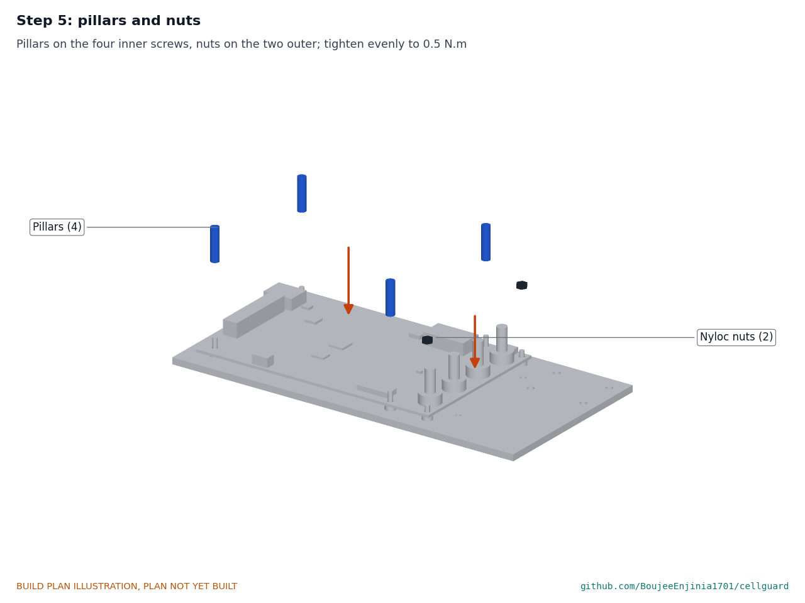

Thread a 20 mm pillar onto each of the four inner screws (at the signal end and beside the precharge resistor and shunt) and a nyloc nut onto each of the two corner screws at the power end. Tighten all six evenly, a little at a time in a cross pattern, to about 0.5 N·m, holding each screw head from below.

### Step 6: fuse holder onto the plate

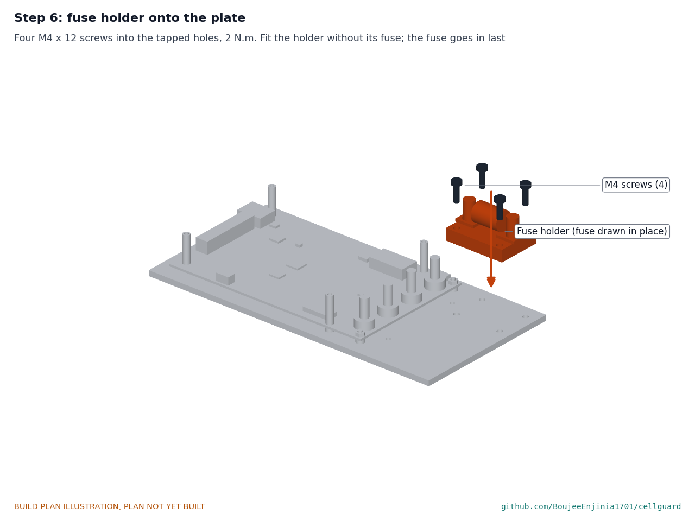

Fit the holder without its fuse, on the B+ side at the power end, with four M4 x 12 screws into the tapped holes, about 2 N·m. The fuse goes in last (section 6).

### Step 7: fuse link

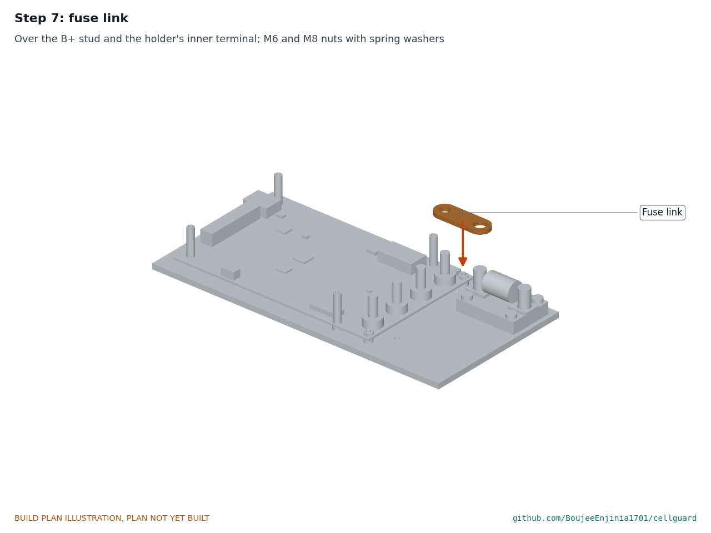

Lay the link over the B+ stud and the holder's inner terminal stud. Fit an M6 nut with spring washer on the B+ stud and an M8 nut with spring washer on the holder terminal, to the stud and holder makers' torques. Hold the B+ stud's shoulder with a spanner while tightening so no twist reaches the solder joints.

### Step 8: temperature probe leads

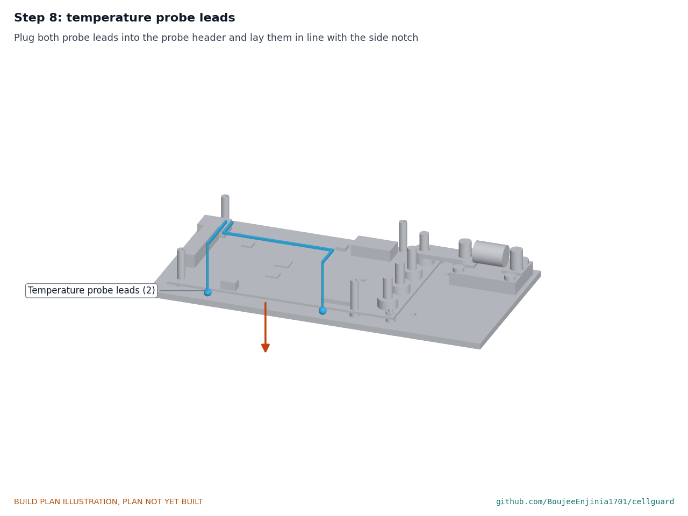

Plug both probe leads into the probe header and lay them along the board toward the side notch.

### Step 9: cover

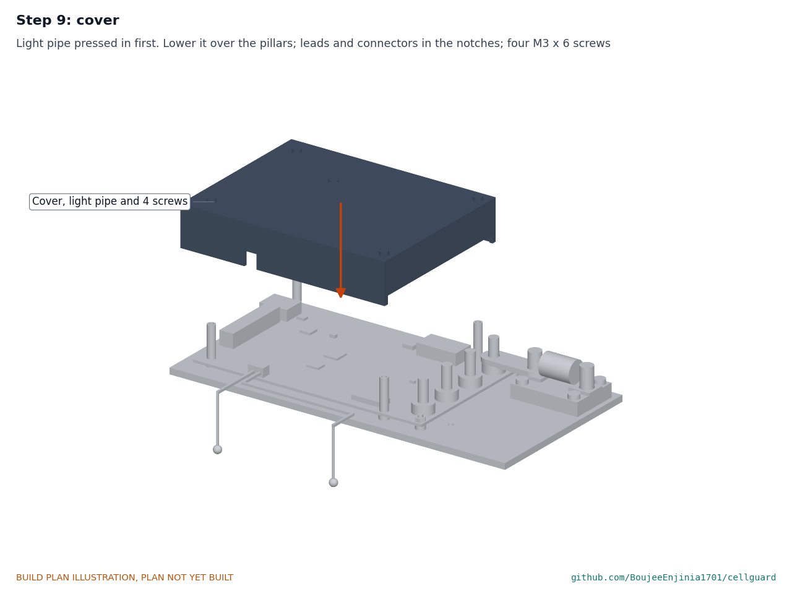

With the light pipe already pressed into the cover (section 3.5), lower the cover straight down over the pillars, with the probe leads in the side notch and the connectors in the signal-end notch. Fit four M3 x 6 pan-head screws into the pillars, hand tight. **Hold point:** the cover touches nothing but the pillar tops.

### Step 10: balance harness and CAN plug

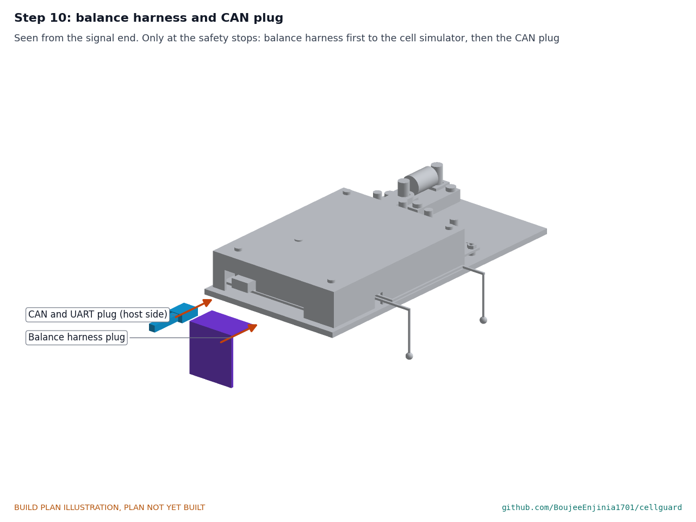

Seen from the signal end. Only at the safety stops of section 6, and in the order of Figure 15: first the balance harness plug, with the cell simulator connected to its far end, then the CAN and UART plug from the host.

## 5. First checks

These are the checks a TRL 4 test report would record; this plan only lists them. Requirement numbers are those of CGD-REQ-001. Use a cell simulator (or a string of current-limited bench supplies) until the pack checks at the end.

*Table 2. First checks.*

| Check | Requirement | How | Pass when |
| --- | --- | --- | --- |
| Switches touch the pad | R5 | After the first full tightening, take the board off once and look at the pad | All eight switches have left an even print on the pad; refit with a new pad |
| Insulation to the plate | R1 | Meter on its highest resistance range between the plate and each stud, board unpowered | No reading below 10 MΩ |
| Cover fit | R14 | Fit the cover; measure the assembly | Nothing touches the cover but the pillars; 220 x 110 x 33 mm or less |
| Cell voltage reading | R2 | Cell simulator at 3.30 V per cell; compare each reported cell with a calibrated meter | Within 10 mV at room temperature |
| Overvoltage and undervoltage trips | R3 | Raise one simulated cell slowly to 3.70 V, then lower one to 2.45 V | The charge switches open at 3.65 V and the discharge switches at 2.50 V, within the chip's stated accuracy |
| Secondary protector | R4 | With the protector fuse's heater output wired to an indicator in place of the fuse, raise one simulated cell past the protector's threshold with the main protection disabled | The protector output switches on |
| Current reading and calibration | R9 | Bench supply and electronic load at 20 A through a calibrated reference shunt; one-point gain calibration; repeat at 40 A | Within 1 % of reading plus 50 mA after calibration |
| Precharge | R13 | 2 mF capacitor bank on P+ and P-; enable the output from the host | The bank reaches 90 % of the input voltage within 1 s before the main switches close |
| Sleep and ship-mode current | R10 | Microammeter in the supply lead, output on, CAN in standby; then ship mode | 300 µA or less, then 10 µA or less |
| CAN and UART | R11 | USB-to-CAN adapter at 250 kbit/s; terminal at 115,200 baud | Status frames received; the output stays off until the enable line is pulled |
| Board loss and temperatures at 40 A | R5, R6 | Current-limited supply and electronic load at 40 A for 30 minutes, thermocouples on the plate and next to the hottest switch; measure the drop from B+ to P+ and from P- to B- | Plate rise near the calculated 10 K; switch case well under 110 °C; loss recorded against the 4 W target |
| Balancing temperature | R7 | Simulated cells 20 mV apart, balancing on, 40 °C room or hot box | A balance resistor stays at 70 °C or less |
| Mass | R14 | Weigh the assembly without power cables | Recorded against 0.7 kg (0.664 kg calculated; R14 relaxed on 2026-10-02) |

## 6. Safety stops

Stop at each point. Carry on only when everything listed is true.

- **S1. Before anything is connected.** The insulation check of section 5 passes. The fuse is out of its holder. Every stud has its nut and is covered with an insulating boot or tape.
- **S2. Before the first power-up.** The power source is a cell simulator or a current-limited bench supply, never a pack. Each balance lead voltage has been measured with a meter at the plug, from B- upward, before the plug goes in. The pack-side ends of the balance leads carry their fuses or resistors.
- **S3. Before the first real pack.** Every simulator check of section 5 passes. The short-circuit delay reads back as 15 µs. The fuse is the 60 A, 80 V DC, 10 kA part. Insulated tools only; no rings or watches. The pack is small (4S, 20 Ah or less) and sits on a non-combustible surface.
- **S4. Before the fuse goes in.** All cables are on and tight, B- connected first; the load is off and the host enable line is off.
- **S5. Before any high-current or charging test.** Attended the whole time, on a non-combustible surface, with a lithium-rated or Class D extinguisher and dry sand within reach. Plate temperature checked every 10 minutes. The charger has a fixed end-of-charge voltage set for the pack. Stop if the plate passes 70 °C or any cell passes 3.65 V.
- **S6. After any trip of the protector fuse, or any smell, smoke or swelling.** Disconnect the pack (fuse out first), let everything cool, and inspect the board before any repair.

## 7. Tools, skills and workspace

**Tools.** Hacksaw with a 24 teeth per inch blade (or a bandsaw); bench vice with soft jaws; bench drill; drills 3.3, 3.4, 6.5 and 8.5 mm; 90° countersink; M4 tap and wrench; flat files and a fine stone; scriber, engineer's square, steel rule, straight edge and calipers; sharp knife and cutting mat; heat gun; 3D printer with an enclosure and a bed of at least 140 x 110 mm that prints polycarbonate; hot plate for reflow, hot-air station and a fine-tip soldering iron with a large tip for the studs; solder paste, flux, braid and magnifier; torque screwdriver covering about 0.5 to 5 N·m and spanners for M3 to M8; multimeter with a high resistance range; microammeter; cell simulator (or several isolated current-limited bench supplies, 0 to 60 V); electronic load rated 60 V and 40 A or more; calibrated reference shunt; 2 mF capacitor bank rated 63 V or more; oscilloscope; USB-to-CAN adapter; thermocouple meter; scale to 2 kg.

**Skills.** No certified trade is needed. Basic metalwork (marking out, sawing, drilling, countersinking, tapping, filing); surface-mount soldering of 0.5 mm pitch chips with paste and a hot plate; safe work with lithium packs and bench supplies. All circuits are extra-low voltage: under 60 V DC at the studs. The bench supplies and loads must be certified, undamaged units; no mains wiring is part of this build.

**Workspace.** A bench about 1.2 x 0.6 m with an antistatic mat for the electronics, kept apart from the metalwork so chips stay off the board; fume extraction for soldering; a ventilated place for the printer; a separate battery test area on a non-combustible surface with the extinguisher and sand of S5.

**Personal protective equipment.** Safety glasses for cutting, drilling, soldering and all battery work; cut-resistant gloves for sheet edges; heat-resistant gloves near the hot plate; no gloves near a turning drill.

## 8. Where the numbers come from

- Model and constructability checks: `cad/src/model.py` (`python cad/src/model.py --check`, 55 checks); STEP and STL exports in `cad/step/` and `cad/stl/`.
- Pictures: `cad/src/build_plan_media.py`, using `.kit/build_views.py`; written to `docs/05-build-plan/` and `cad/drawings/CGD-DWG-101` to `CGD-DWG-105` (CGD-DWG-103 and CGD-DWG-104 at Rev P2).
- General arrangement: `cad/drawings/CGD-DWG-001.pdf`, Rev P3.
- Calculations: `docs/04-calcs/01-sizing.md` (CGD-CAL-001 v0.6) and `docs/04-calcs/sizing.py`: losses and temperatures (section 3), protection settings (section 4), mass (section 10), cost (section 11).
- Bill of materials: `bom/bom.csv`.
- Decisions: `docs/decisions/0003-design-for-construction.md` (CGD-DDR-003), with CGD-DDR-001, CGD-DDR-002 and the design decisions register `docs/06-design-decisions.md` (CGD-DEC-001).
- Requirements: `docs/03-requirements.md` (CGD-REQ-001 v0.8).
